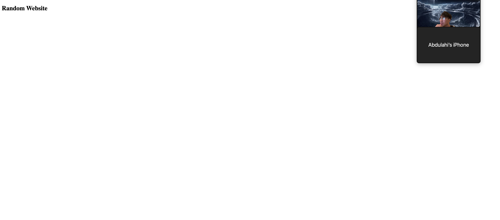

<!-- Description of your application, a screenshot of your app, and a link to the deployed application -->

# HTML-README-DEMO

    This is an HTML/README demo app

[Here is a link to the deployed application](https://junonguyen.github.io/html-readme-demo/)

